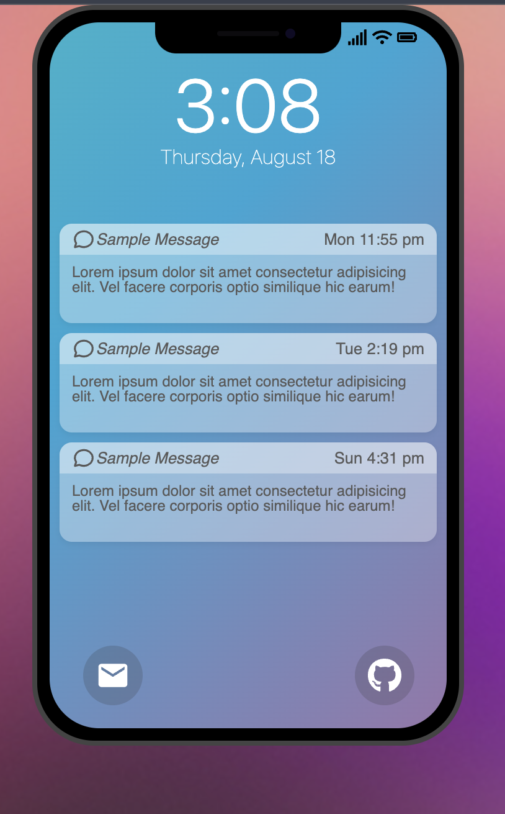

# iphone-ui-react-app

## Table of Contents

- [About](#about)
- [Getting Started](#getting_started)
- [Example](#example)
<!-- - [Contributing](../CONTRIBUTING.md) -->

## About <a name = "about"></a>

A simple template for creating a React App UI that looks like an iPhone lock screen.

## Getting Started <a name = "getting_started"></a>

These instructions will get you a copy of the project up and running on your local machine for development and testing purposes. See [deployment](#deployment) for notes on how to deploy the project on a live system.

### Prerequisites

Node.js

```
https://nodejs.org
```

### Installing

A step by step series of examples that tell you how to get a development env running.

Clone the repository

```
git clone https://github.com/codechipped/iphone-ui-react-app
```

Navigate your terminal to the project directory and run

```
npm install
```

## Example <a name = "example"></a>


